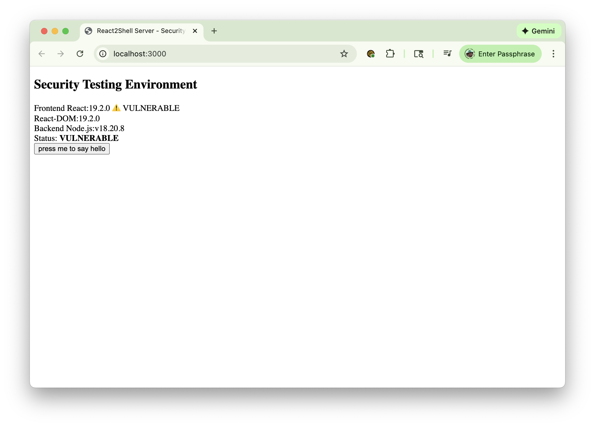
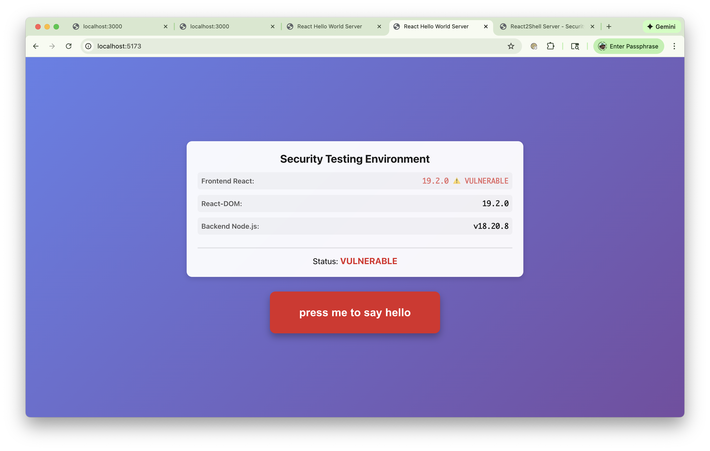

# React Hello World Server

**Purpose: Security Testing Project**

This project provides a React application with easily switchable React versions, including **vulnerable versions** for security scanner testing. The primary purpose is to enable security scanners and testing tools to detect and validate detection of the React Server Components security vulnerability (CVE).

A React application with a backend server that displays a big red button. When clicked, the button sends a request to the server, which responds with "Hello World!". This simple application serves as a testbed for security scanners to identify vulnerable React versions.

## Purpose

This project is designed to provide **scannable vulnerable React versions** for security testing purposes. It allows security scanners and testing tools to:

- Detect vulnerable React versions in a controlled environment
- Validate that security scanners correctly identify the React Server Components vulnerability
- Test scanner accuracy by switching between vulnerable and fixed versions
- Provide a reproducible test environment for security research

**⚠️ WARNING: This project intentionally includes vulnerable React versions. Do NOT use in production environments.**

## Security Vulnerability

### React Server Components Vulnerability

**CVE Reference:** [React Security Advisory - Critical Security Vulnerability in React Server Components](https://react.dev/blog/2025/12/03/critical-security-vulnerability-in-react-server-components)

The vulnerability affects React Server Components in the following versions:
- React 19.0
- React 19.1.0
- React 19.1.1
- React 19.2.0

Fixed versions:
- React 19.0.1
- React 19.1.2
- React 19.2.1

### Next.js RSC Vulnerability

**CVE Reference:** [Next.js Security Advisory - CVE-2025-66478](https://nextjs.org/blog/CVE-2025-66478)

This project also supports Next.js framework mode for testing Next.js-specific vulnerabilities. The vulnerability affects Next.js applications using React Server Components.

**Vulnerable Next.js versions:**
- Next.js 14.0.0
- Next.js 14.1.0
- Next.js 15.0.0

**Fixed Next.js versions:**
- Next.js 14.0.1
- Next.js 14.1.1
- Next.js 15.1.0

> **Note:** Next.js version switching is only available when in Next.js mode (`make use-nextjs`). See [Framework Switching](#framework-switching) section for details.

## Features

- Big red button UI with smooth animations
- Express.js backend server
- React frontend with version switching capability
- Easy switching between React versions (including vulnerable versions for security testing)
- Support for testing React Server Components security vulnerability (CVE)

## React Version Switching

This project supports easy switching between different React versions using a Makefile.

### Available React Versions

**Vulnerable Versions (for security testing):**
- React 19.0 ⚠️ VULNERABLE
- React 19.1.0 ⚠️ VULNERABLE
- React 19.1.1 ⚠️ VULNERABLE
- React 19.2.0 ⚠️ VULNERABLE

**Fixed Versions:**
- React 19.0.1 ✅ FIXED
- React 19.1.2 ✅ FIXED
- React 19.2.1 ✅ FIXED

> **Security Note:** Versions 19.0, 19.1.0, 19.1.1, and 19.2.0 contain a critical security vulnerability in React Server Components. This project supports these versions for security scanner testing purposes.
>
> **CVE Documentation:** 
> - [React Security Advisory](https://react.dev/blog/2025/12/03/critical-security-vulnerability-in-react-server-components)
> - [Next.js Security Advisory - CVE-2025-66478](https://nextjs.org/blog/CVE-2025-66478)

### Makefile Commands

```bash
# Switch to vulnerable versions (for security testing)
make vulnerable      # Switch to React 19.0 (VULNERABLE) - quick option
make react-19.0      # Switch to React 19.0 (VULNERABLE)
make react-19.1.0    # Switch to React 19.1.0 (VULNERABLE)
make react-19.1.1    # Switch to React 19.1.1 (VULNERABLE)
make react-19.2.0    # Switch to React 19.2.0 (VULNERABLE)

# Switch to fixed versions
make react-19.0.1    # Switch to React 19.0.1 (FIXED)
make react-19.1.2    # Switch to React 19.1.2 (FIXED)
make react-19.2.1    # Switch to React 19.2.1 (FIXED)

# Framework Switching
make use-vite        # Switch to Vite + React mode (default)
make use-nextjs      # Switch to Next.js mode
make current-framework # Show current framework mode

# Next.js Version Switching (only available in Next.js mode)
make use-nextjs      # First, switch to Next.js mode
make nextjs-14.0.0   # Switch to Next.js 14.0.0 (VULNERABLE)
make nextjs-14.1.0   # Switch to Next.js 14.1.0 (VULNERABLE)
make nextjs-15.0.0   # Switch to Next.js 15.0.0 (VULNERABLE)
make nextjs-14.0.1   # Switch to Next.js 14.0.1 (FIXED)
make nextjs-14.1.1   # Switch to Next.js 14.1.1 (FIXED)
make nextjs-15.1.0   # Switch to Next.js 15.1.0 (FIXED)

# Check current React version
make current-version

# Install dependencies for current version
make install

# Clean node_modules and package-lock.json
make clean

# Server Management
make start           # Start both frontend and backend servers
make stop            # Stop both servers
make status          # Check status of servers
make tail-vite       # Tail frontend server log (Ctrl+C to exit)
make tail-server     # Tail backend server log (Ctrl+C to exit)

# Show help
make help
```

## Security Scanner Testing

To test your security scanner against vulnerable React versions:

1. **Switch to a vulnerable version:**
   ```bash
   make react-19.2.0  # or any other vulnerable version
   ```

2. **Start the application:**
   ```bash
   make start       # Starts both servers automatically
   ```
   Or manually:
   ```bash
   npm run dev      # Terminal 1
   npm run server   # Terminal 2
   ```

3. **Run your security scanner** against the application

4. **Switch to a fixed version** to verify scanner detects the difference:
   ```bash
   make react-19.2.1  # FIXED version
   ```

### Scanner Verification

This project includes automated scanner verification to ensure that security scanners correctly detect vulnerabilities when scanning different React versions.

**Available Methods:**

1. **Python Test Suite** (pytest-based):
   ```bash
   make test-scanner
   ```
   Runs pytest tests that switch between versions and verify scanner detection.

2. **Standalone Script**:
   ```bash
   make test-scanner-script
   ```
   Runs a shell script that tests all vulnerable and fixed versions.

**Requirements:**
- Scanner must be available at: `/Users/lblackb/data/lblackb/git/third-party/react2shell-scanner`
- Scanner dependencies must be installed (see scanner's `requirements.txt`)

**What It Tests:**
- ✅ Vulnerable versions (19.0, 19.1.0, 19.1.1, 19.2.0) are correctly detected as vulnerable
- ✅ Fixed versions (19.0.1, 19.1.2, 19.2.1) are correctly identified as not vulnerable

**Note:** Scanner verification is kept separate from the main test suite to avoid slowing down regular test execution. See `docs/SCANNER_INTEGRATION.md` for detailed analysis of pros/cons.

## Setup

1. **Clone the repository** (if applicable) or navigate to the project directory

2. **Switch to your desired React version** (for security testing, use a vulnerable version):
   ```bash
   make react-19.0
   ```
   Or choose any other version:
   ```bash
   make react-19.1.0
   make react-19.1.1
   make react-19.2.0
   ```

3. **Verify the React version**:
   ```bash
   make current-version
   ```

## Development

### Quick Start (Recommended)

**Start both servers with one command:**
```bash
make start
```

This will:
- Start both the Vite dev server (port 5173) and Express server (port 3000) in the background
- Capture output to log files (`.logs/vite.log` and `.logs/server.log`)
- Display the URLs to access the application
- Wait for servers to be ready

**Check server status:**
```bash
make status
```

**View server logs (live):**
```bash
make tail-vite      # View frontend server log
make tail-server    # View backend server log
```

**Stop both servers:**
```bash
make stop
```

### Manual Start (Alternative)

If you prefer to start servers manually:

1. **Start the Vite dev server** (runs on port 5173):
   ```bash
   npm run dev
   ```

2. **In a separate terminal, start the Express server** (runs on port 3000):
   ```bash
   npm run server
   ```

3. **Open your browser** to `http://localhost:5173`

The Vite dev server is configured to proxy API requests to the Express server.

### Production Mode

1. **Build the React app**:
   ```bash
   npm run build
   ```

2. **Start the server**:
   ```bash
   npm run server
   ```

   Or use the combined command:
   ```bash
   npm start
   ```

3. **Open your browser** to `http://localhost:3000`

## Testing

This project includes Python Selenium end-to-end tests using **pytest** framework.

### Quick Start

```bash
# Set up test environment (first time only)
make test-setup

# Run all tests (automatically starts servers if needed)
make test

# Run tests in parallel (faster - 4 workers)
make test-parallel

# Run tests with HTML report
make test-report
make test-open-report
```

### Test Commands

**Makefile shortcuts:**
- `make test-setup` - Set up Python virtual environment
- `make test` - Run all tests
- `make test-quick` - Quick test run (headless)
- `make test-parallel` - Run tests in parallel (10 workers, faster execution)
- `make test-report` - Generate HTML report
- `make test-smoke` - Run smoke tests only
- `make test-hello` - Run hello world tests
- `make test-version` - Run version info tests
- `make test-security` - Run security status tests
- `make test-version-switch` - Run version switch tests (tests all React versions, slower)
- `make test-browser BROWSER=chrome` - Run with specific browser
- `make test-clean` - Clean test artifacts

**Performance Tracking:**
- `make test-performance-report` - Generate and open comprehensive HTML performance report
- `make test-performance-compare` - Compare latest run against baseline
- `make test-performance-trends` - View performance trends
- `make test-performance-slowest` - List slowest tests
- `make test-update-baseline` - Update performance baseline

**For detailed documentation:**
- **[Quick Start Guide](tests/QUICKSTART.md)** - Get started in 5 minutes
- **[Complete Testing Guide](tests/README.md)** - Comprehensive documentation
- **[Performance Tracking Guide](tests/PERFORMANCE_TRACKING.md)** - Performance metrics and limits
- **[Testing Plan](TESTING_PLAN.md)** - Testing strategy and implementation plan

## Project Structure

```
react2shell-server/
├── Makefile                  # React version switching and server management
├── package.json              # Dependencies (React version updated by Makefile)
├── vite.config.js            # Vite build configuration
├── server.js                 # Express server
├── index.html                # HTML entry point
├── start-cursor-agent.sh     # Cursor IDE agent startup script
├── src/
│   ├── App.jsx               # Main React component
│   ├── index.jsx             # React entry point
│   └── App.css               # Styles
├── tests/                    # Python Selenium tests
│   ├── conftest.py           # Pytest fixtures and configuration
│   ├── pytest.ini            # Pytest settings
│   ├── requirements.txt     # Python test dependencies
│   ├── pages/                # Page Object Model
│   │   ├── base_page.py      # Base page class
│   │   └── app_page.py       # Application page
│   ├── test_suites/          # Test files
│   │   ├── test_hello_world.py
│   │   ├── test_version_info.py
│   │   └── test_security_status.py
│   ├── utils/                # Test utilities
│   │   └── server_manager.py # Server management
│   └── reports/              # Test reports (generated)
├── dist/                     # Build output (generated)
├── .pids/                    # Server PID files (generated by make start)
└── .logs/                    # Server log files (generated by make start)
```

## API Endpoints

- **GET /api/hello**
  - Returns: `{ "message": "Hello World!" }`

- **GET /api/version**
  - Returns: `{ "react": "version", "reactDom": "version", "node": "version", "vulnerable": boolean, "status": "VULNERABLE" | "FIXED" }`

## Development Tools

### Cursor Agent Script

The `start-cursor-agent.sh` script provides a convenient way to start a Cursor IDE agent session for AI-assisted development.

**Usage:**
```bash
./start-cursor-agent.sh
```

**Requirements:**
- Cursor IDE installed
- `cursor-agent` command available in PATH

**What it does:**
- Starts a Cursor agent session with a specific resume ID
- Allows resuming previous agent sessions for continuity
- Enables AI-assisted development workflows within Cursor IDE

**Note:** This script is optional and only needed if you're using Cursor IDE's agent features for development assistance.

## Switching React Versions

To switch React versions during development:

1. **Stop any running servers**

2. **Switch to the desired version**:
   ```bash
   make react-19.2.0
   ```

3. **Verify the switch**:
   ```bash
   make current-version
   ```

4. **Restart your development servers**

## Requirements

### Application Requirements
- Node.js (v18 or higher recommended)
- npm
- make (usually pre-installed on macOS/Linux)

### Testing Requirements
- Python 3.8 or higher
- pip (Python package manager)
- pytest and Selenium (installed via `tests/requirements.txt`)
- Browser (Chrome, Firefox, or Safari) for Selenium tests

## Troubleshooting

### If `make` command is not found

On Windows, you may need to use WSL or install make. Alternatively, you can manually update `package.json` and run `npm install`.

### If dependencies fail to install

Try cleaning and reinstalling:
```bash
make clean
make install
```

### Port already in use

If port 3000 or 5173 is already in use, you can:
- Change the port in `server.js` (PORT environment variable)
- Change the port in `vite.config.js` (server.port)

### Test-related Issues

See [tests/README.md](tests/README.md#troubleshooting) for detailed troubleshooting guide.

Common issues:
- **Tests fail with "Server not ready"**: Run `make start` to ensure servers are running
- **Browser driver issues**: Tests auto-manage drivers via `webdriver-manager`
- **Import errors**: Ensure virtual environment is activated and dependencies installed
- **Port conflicts**: Use `make stop` to free ports

## Defect Tracking

This section tracks known bugs and issues in the project.

| ID | Status | Priority | Severity | Title | Description |
|----|--------|----------|----------|-------|-------------|
| BUG-1 | Fixed | High | High | Version API Endpoint Not Accessible in Dev Mode | `/api/version` endpoint fails in development mode due to Vite proxy configuration | See details below |
| BUG-2 | Fixed | High | High | Missing pytest Option Registration After Refactoring | `--update-baseline` option not registered, causing `ValueError: no option named '--update-baseline'` when running tests | See details below |
| BUG-3 | Open | Medium | Medium | Next.js Version Not Displayed in UI | Next.js version is returned by API but not displayed in the UI. Should match React version display format with vulnerability status indicator | See details below |
| BUG-4 | Open | Medium | Medium | Next.js Frontend Layout Mismatch | Next.js UI layout does not match React frontend layout. Visual differences in spacing, alignment, or component structure | See details below |

### BUG-1: Version API Endpoint Not Accessible in Dev Mode

**Status:** Fixed  
**Priority:** High  
**Severity:** High  
**Reported:** 2025-01-XX  
**Fixed:** 2025-01-XX

**Description:**
The version information display shows "Unable to load version information" error message in red italicized text. The `/api/version` endpoint is not accessible when running in development mode (Vite dev server). The error occurs because the Vite proxy configuration in `vite.config.js` only proxies `/api` requests, but the frontend is trying to fetch `/api/version` which may not be properly routed to the Express backend server running on port 3000.

**Screenshots:**

**Before Fix (Bug State):**

*Shows the error: "Unable to load version information" in red italicized text*

**After Fix (Resolved):**

*Shows successful version information display with React 19.1.0 correctly identified as VULNERABLE*

**Visual Evidence:**
The before screenshot shows:
- A white card displaying "Security Testing Environment" title
- Red italicized error text: "Unable to load version information"
- The red button "press me to say hello" is still functional below the error

The after screenshot shows:
- Version information successfully loaded
- Frontend React: 19.1.0 ⚠️ VULNERABLE (correctly identified)
- React-DOM: 19.1.0
- Backend Node.js: v18.20.8
- Status: VULNERABLE (correctly displayed)

**Steps to Reproduce:**
1. Start the development servers:
   ```bash
   npm run dev      # Terminal 1 - Vite dev server on port 5173
   npm run server   # Terminal 2 - Express server on port 3000
   ```
2. Open browser to `http://localhost:5173`
3. Observe the version information card at the top of the page
4. Error message "Unable to load version information" is displayed

**Expected Behavior:**
- Version information should load successfully
- Display Frontend React version, React-DOM version, Backend Node.js version
- Show vulnerability status (VULNERABLE/FIXED) with appropriate indicators

**Actual Behavior:**
- Error message "Unable to load version information" displayed in red italicized text
- Version details are not shown
- The `/api/version` endpoint request fails

**Root Cause:**
The Vite dev server proxy configuration may not be correctly routing `/api/version` requests to the Express backend, or the Express server may not be running when the frontend tries to fetch version information.

**Environment:**
- React Version: 19.1.0 (or any version)
- Node.js Version: [To be determined]
- Browser: [To be determined]
- OS: macOS (based on workspace path)
- Development Mode: Vite dev server (port 5173) + Express server (port 3000)

**Files Affected:**
- `src/App.jsx` - Frontend code that fetches `/api/version`
- `server.js` - Backend `/api/version` endpoint definition
- `vite.config.js` - Vite proxy configuration for API routes

**Solution Implemented:**
1. ✅ Added CORS headers to Express server to allow cross-origin requests
2. ✅ Improved error handling in frontend with response status checking
3. ✅ Added retry logic with 1-second delay for server startup scenarios
4. ✅ Enhanced Vite proxy configuration with additional options (secure: false, ws: true)
5. ✅ Added error handling and logging in `/api/version` endpoint
6. ✅ Added console logging for version endpoint in server startup

**Files Modified:**
- `server.js` - Added CORS middleware and error handling
- `src/App.jsx` - Improved fetch error handling with retry logic
- `vite.config.js` - Enhanced proxy configuration

**Verification:**
✅ Fix verified - Version information now displays correctly showing:
- Frontend React version (19.1.0) with vulnerability status indicator
- React-DOM version
- Backend Node.js version
- Overall security status (VULNERABLE/FIXED)

See screenshots above for before/after comparison.

**Additional Notes:**
- The `/api/hello` endpoint works correctly
- This issue only affected development mode; production builds work correctly
- The fix ensures proper CORS handling and retry logic for server startup scenarios

### BUG-2: Missing pytest Option Registration After Refactoring

**Status:** Fixed  
**Priority:** High  
**Severity:** High  
**Reported:** 2025-12-08  
**Fixed:** 2025-12-08

**Description:**
After the DRY refactoring (Phase 3), all test execution fails with `ValueError: no option named '--update-baseline'`. The error occurs in `tests/conftest.py` line 65 when `pytest_configure` tries to access the `--update-baseline` option that was moved to `plugins/performance.py` during refactoring.

**Error Message:**
```
ValueError: no option named '--update-baseline'
```

**Stack Trace:**
```
File "/Users/lblackb/data/lblackb/git/react2shell-server/tests/conftest.py", line 65, in pytest_configure
    if config.getoption("--update-baseline"):
File "/Users/lblackb/data/lblackb/git/react2shell-server/venv/lib/python3.13/site-packages/_pytest/config/__init__.py", line 1897, in getoption
    raise ValueError(f"no option named {name!r}") from e
```

**Steps to Reproduce:**
1. Run any test command:
   ```bash
   make test-parallel
   # or
   make test
   # or
   pytest tests/
   ```
2. Error occurs immediately during pytest configuration phase
3. All tests fail to run

**Expected Behavior:**
- Tests should run successfully
- `--update-baseline` option should be available when accessed in `pytest_configure`
- Performance tracking should work correctly

**Actual Behavior:**
- All test execution fails with `ValueError`
- No tests can run
- Both non-version-switch tests and version-switch tests fail
- Error occurs in both parallel and sequential test execution

**Root Cause:**
During Phase 3 refactoring, the `pytest_addoption` function that registers `--update-baseline` was moved from `conftest.py` to `plugins/performance.py`. However, `pytest_configure` in `conftest.py` still tries to access this option. The issue is that:

1. `pytest_configure` in `conftest.py` runs and tries to access `--update-baseline` option
2. The `pytest_addoption` in `plugins/performance.py` may not have been called yet, or the plugin registration order causes the option to not be available
3. Pytest raises `ValueError` because the option doesn't exist in the namespace

**Environment:**
- Python Version: 3.13.7
- pytest Version: Latest (from requirements.txt)
- OS: macOS (darwin 24.6.0)
- Test Command: `make test-parallel`, `make test`, or direct pytest invocation

**Files Affected:**
- `tests/conftest.py` - Line 65: `if config.getoption("--update-baseline"):`
- `tests/plugins/performance.py` - Contains `pytest_addoption` for `--update-baseline` (if present)

**Impact:**
- **Critical:** All test execution is blocked
- Cannot run any tests until this is fixed
- Affects all test targets: `test`, `test-parallel`, `test-smoke`, etc.
- Blocks CI/CD pipelines

**Solution Implemented:**
1. ✅ Added `pytest_addoption` function to `plugins/performance.py` to register `--update-baseline` option
2. ✅ The option is now properly registered when the performance plugin is imported
3. ✅ `pytest_configure` in `conftest.py` can now safely access the option

**Files Modified:**
- `tests/plugins/performance.py` - Added `pytest_addoption` function to register `--update-baseline` option

**Verification:**
✅ Fix verified - The `--update-baseline` option is now properly registered and accessible in `pytest_configure`

**Additional Notes:**
- This was a regression introduced during the refactoring (Phase 3: File Reorganization)
- The refactoring moved performance tracking code to `plugins/performance.py` but the `pytest_addoption` function was not included
- The fix ensures the option is registered before `pytest_configure` tries to access it

### BUG-3: Next.js Version Not Displayed in UI

**Status:** Open  
**Priority:** Medium  
**Severity:** Medium  
**Reported:** 2025-12-08

**Description:**
When running in Next.js mode, the version information display does not show the Next.js version, even though the API endpoint (`/api/version`) returns it in the response. The React version is displayed with vulnerability status indicators (⚠️ VULNERABLE or ✅ FIXED), but the Next.js version is missing from the UI.

**Expected Behavior:**
- Next.js version should be displayed in the version information card
- Next.js version should follow the same format as React version display
- Next.js version should show vulnerability status indicator if applicable (⚠️ VULNERABLE or ✅ FIXED)
- Format should be: "Next.js: 14.0.0 ⚠️ VULNERABLE" or "Next.js: 15.1.0 ✅ FIXED"

**Actual Behavior:**
- Next.js version is not displayed in the UI
- Only React, React-DOM, and Node.js versions are shown
- API returns `nextjs` field in JSON response, but frontend doesn't render it

**Screenshots:**

*Shows version information display without Next.js version*

**Steps to Reproduce:**
1. Switch to Next.js mode:
   ```bash
   make use-nextjs
   ```
2. Start the Next.js server:
   ```bash
   make start
   ```
3. Open browser to `http://localhost:3000`
4. Observe the version information card
5. Notice that Next.js version is not displayed

**Root Cause:**
The Next.js page component (`frameworks/nextjs/app/page.tsx`) does not include a version item for Next.js, even though the API response includes `nextjs` field.

**Environment:**
- Framework: Next.js mode
- Next.js Version: Any version (14.0.0, 15.0.0, 15.1.0, etc.)
- Browser: Any browser
- OS: Any OS

**Files Affected:**
- `frameworks/nextjs/app/page.tsx` - Missing Next.js version display in version-details section
- `frameworks/nextjs/app/api/version/route.ts` - API correctly returns nextjs field (no changes needed)

**Solution:**
Add Next.js version display to `frameworks/nextjs/app/page.tsx`:
1. Add a new `version-item` div for Next.js version
2. Display `versionInfo.nextjs` with appropriate vulnerability status
3. Determine Next.js vulnerability status (vulnerable versions: 14.0.0, 14.1.0, 15.0.0)
4. Apply same styling and format as React version display

**Impact:**
- **User Experience:** Users cannot see which Next.js version is running
- **Security Testing:** Makes it harder to verify which Next.js version is active for vulnerability testing
- **Consistency:** Inconsistent with React version display format

### BUG-4: Next.js Frontend Layout Mismatch

**Status:** Open  
**Priority:** Medium  
**Severity:** Medium  
**Reported:** 2025-12-08

**Description:**
The Next.js frontend UI layout does not visually match the React (Vite) frontend layout. There are visual differences in spacing, alignment, component structure, or overall appearance that make the two frameworks look different to users, even though they should appear identical except for framework-specific version information.

**Expected Behavior:**
- Next.js UI should look visually identical to React UI
- Same spacing, alignment, colors, fonts, and component structure
- Only difference should be the framework version information displayed (Next.js version in Next.js mode, no Next.js version in React mode)
- All other visual elements (button, message, version card) should be identical

**Actual Behavior:**
- Next.js UI has different visual appearance compared to React UI
- Layout differences may include: spacing, alignment, component positioning, or styling inconsistencies
- Users can visually distinguish between the two frameworks beyond just version information

**Screenshots:**
- **Incorrect Layout (Next.js):** 
- **Correct Layout (React):** 

**Steps to Reproduce:**
1. Switch to React mode:
   ```bash
   make use-vite
   make start
   ```
2. Open browser to `http://localhost:5173` and capture screenshot
3. Switch to Next.js mode:
   ```bash
   make use-nextjs
   make start
   ```
4. Open browser to `http://localhost:3000` and capture screenshot
5. Compare the two screenshots - visual differences should be apparent

**Root Cause:**
The Next.js component structure or CSS may not exactly match the React component structure, causing visual layout differences. This could be due to:
- Different CSS class names or structure
- Missing or different CSS rules
- Component rendering differences between React and Next.js
- Different default styles applied by Next.js

**Environment:**
- Framework: Both Vite+React and Next.js modes
- Browser: Any browser
- OS: Any OS

**Files Affected:**
- `frameworks/nextjs/app/page.tsx` - Next.js page component structure
- `frameworks/nextjs/app/globals.css` - Next.js global styles
- `frameworks/vite-react/src/App.jsx` - React component structure (reference)
- `frameworks/vite-react/src/App.css` - React styles (reference)

**Solution:**
1. Compare React and Next.js component structures side-by-side
2. Ensure CSS files are identical (except for framework-specific comments)
3. Verify component JSX structure matches exactly
4. Test visual appearance in both frameworks
5. Add automated tests to ensure layouts stay in sync

**Impact:**
- **User Experience:** Inconsistent UI between frameworks may confuse users
- **Testing:** Makes it harder to verify that both frameworks work correctly
- **Maintenance:** Requires keeping two separate implementations in sync

---

## License

ISC
