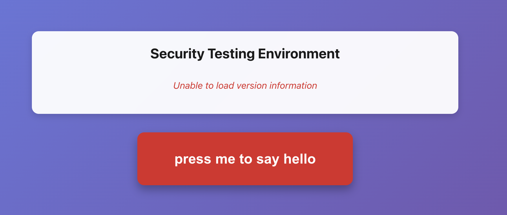

# BUG-1: Version API Endpoint Not Accessible in Dev Mode

**Status:** Fixed  
**Priority:** High  
**Severity:** High  
**Reported:** 2025-01-XX  
**Fixed:** 2025-01-XX

**Description:**
The version information display shows "Unable to load version information" error message in red italicized text. The `/api/version` endpoint is not accessible when running in development mode (Vite dev server). The error occurs because the Vite proxy configuration in `vite.config.js` only proxies `/api` requests, but the frontend is trying to fetch `/api/version` which may not be properly routed to the Express backend server running on port 3000.

**Screenshots:**

**Before Fix (Bug State):**

*Shows the error: "Unable to load version information" in red italicized text*

**After Fix (Resolved):**

*Shows successful version information display with React 19.1.0 correctly identified as VULNERABLE*

**Visual Evidence:**
The before screenshot shows:
- A white card displaying "Security Testing Environment" title
- Red italicized error text: "Unable to load version information"
- The red button "press me to say hello" is still functional below the error

The after screenshot shows:
- Version information successfully loaded
- Frontend React: 19.1.0 ⚠️ VULNERABLE (correctly identified)
- React-DOM: 19.1.0
- Backend Node.js: v18.20.8
- Status: VULNERABLE (correctly displayed)

**Steps to Reproduce:**
1. Start the development servers:
   ```bash
   npm run dev      # Terminal 1 - Vite dev server on port 5173
   npm run server   # Terminal 2 - Express server on port 3000
   ```
2. Open browser to `http://localhost:5173`
3. Observe the version information card at the top of the page
4. Error message "Unable to load version information" is displayed

**Expected Behavior:**
- Version information should load successfully
- Display Frontend React version, React-DOM version, Backend Node.js version
- Show vulnerability status (VULNERABLE/FIXED) with appropriate indicators

**Actual Behavior:**
- Error message "Unable to load version information" displayed in red italicized text
- Version details are not shown
- The `/api/version` endpoint request fails

**Root Cause:**
The Vite dev server proxy configuration may not be correctly routing `/api/version` requests to the Express backend, or the Express server may not be running when the frontend tries to fetch version information.

**Environment:**
- React Version: 19.1.0 (or any version)
- Node.js Version: [To be determined]
- Browser: [To be determined]
- OS: macOS (based on workspace path)
- Development Mode: Vite dev server (port 5173) + Express server (port 3000)

**Files Affected:**
- `src/App.jsx` - Frontend code that fetches `/api/version`
- `server.js` - Backend `/api/version` endpoint definition
- `vite.config.js` - Vite proxy configuration for API routes

**Solution Implemented:**
1. ✅ Added CORS headers to Express server to allow cross-origin requests
2. ✅ Improved error handling in frontend with response status checking
3. ✅ Added retry logic with 1-second delay for server startup scenarios
4. ✅ Enhanced Vite proxy configuration with additional options (secure: false, ws: true)
5. ✅ Added error handling and logging in `/api/version` endpoint
6. ✅ Added console logging for version endpoint in server startup

**Files Modified:**
- `server.js` - Added CORS middleware and error handling
- `src/App.jsx` - Improved fetch error handling with retry logic
- `vite.config.js` - Enhanced proxy configuration

**Verification:**
✅ Fix verified - Version information now displays correctly showing:
- Frontend React version (19.1.0) with vulnerability status indicator
- React-DOM version
- Backend Node.js version
- Overall security status (VULNERABLE/FIXED)

See screenshots above for before/after comparison.

**Additional Notes:**
- The `/api/hello` endpoint works correctly
- This issue only affected development mode; production builds work correctly
- The fix ensures proper CORS handling and retry logic for server startup scenarios
