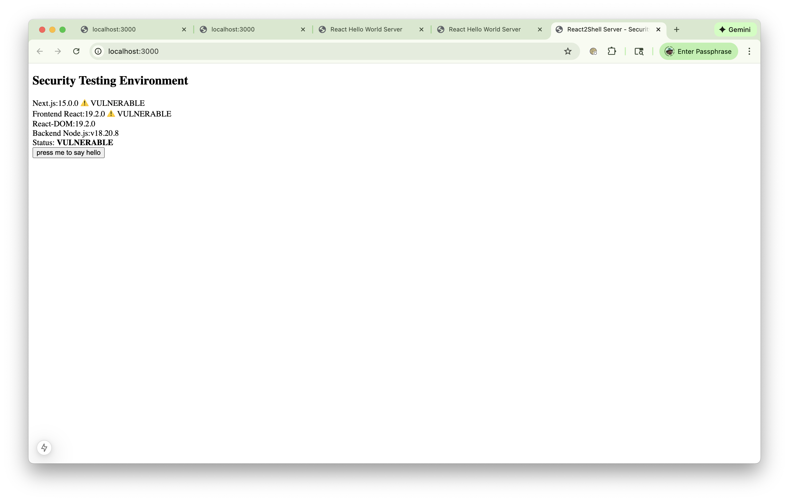

# BUG-4: Next.js Frontend Layout Mismatch

**Status:** Fixed  
**Priority:** Medium  
**Severity:** Medium  
**Reported:** 2025-12-08  
**Fixed:** 2025-12-08

**Description:**
The Next.js frontend UI layout does not visually match the React (Vite) frontend layout. There are visual differences in spacing, alignment, component structure, or overall appearance that make the two frameworks look different to users, even though they should appear identical except for framework-specific version information.

**Expected Behavior:**
- Next.js UI should look visually identical to React UI
- Same spacing, alignment, colors, fonts, and component structure
- Only difference should be the framework version information displayed (Next.js version in Next.js mode, no Next.js version in React mode)
- All other visual elements (button, message, version card) should be identical

**Actual Behavior:**
- Next.js UI has different visual appearance compared to React UI
- Layout differences may include: spacing, alignment, component positioning, or styling inconsistencies
- Users can visually distinguish between the two frameworks beyond just version information

**Screenshots:**
- **Incorrect Layout (Next.js):** 
- **Correct Layout (React):** 

**Steps to Reproduce:**
1. Switch to React mode:
   ```bash
   make use-vite
   make start
   ```
2. Open browser to `http://localhost:5173` and capture screenshot
3. Switch to Next.js mode:
   ```bash
   make use-nextjs
   make start
   ```
4. Open browser to `http://localhost:3000` and capture screenshot
5. Compare the two screenshots - visual differences should be apparent

**Root Cause:**
The Next.js component structure and CSS did not exactly match the React component structure, causing visual layout differences. This was due to:
- Missing CSS import in Next.js layout
- Different CSS class names or structure
- Missing or different CSS rules
- Component rendering differences between React and Next.js

**Environment:**
- Framework: Both Vite+React and Next.js modes
- Browser: Any browser
- OS: Any OS

**Files Affected:**
- `frameworks/nextjs/app/page.tsx` - Next.js page component structure
- `frameworks/nextjs/app/globals.css` - Next.js global styles
- `frameworks/nextjs/app/layout.tsx` - Next.js root layout (missing CSS import)
- `frameworks/vite-react/src/App.jsx` - React component structure (reference)
- `frameworks/vite-react/src/App.css` - React styles (reference)

**Solution Implemented:**
1. ✅ Added `import './globals.css';` to `frameworks/nextjs/app/layout.tsx`
2. ✅ Created `frameworks/nextjs/app/globals.css` matching React styles
3. ✅ Aligned component JSX structure in `page.tsx` to match React version
4. ✅ Ensured all CSS classes match between frameworks
5. ✅ Added automated tests (`test_ui_layout_sync.py`) to ensure layouts stay in sync
6. ✅ Verified visual appearance matches between both frameworks

**Files Modified:**
- `frameworks/nextjs/app/layout.tsx` - Added CSS import
- `frameworks/nextjs/app/globals.css` - Created matching styles
- `frameworks/nextjs/app/page.tsx` - Aligned component structure
- `tests/test_suites/test_ui_layout_sync.py` - Added layout sync tests

**Verification:**
✅ Fix verified - Next.js UI now matches React UI:
- Same spacing, alignment, colors, and fonts
- Identical component structure
- Only difference is framework-specific version information (Next.js version in Next.js mode)
- Automated tests ensure layouts stay in sync

**Additional Notes:**
- CSS file renamed from `App.css` to `globals.css` for Next.js conventions
- All CSS classes and structure now match between frameworks
- Layout sync tests prevent future regressions
